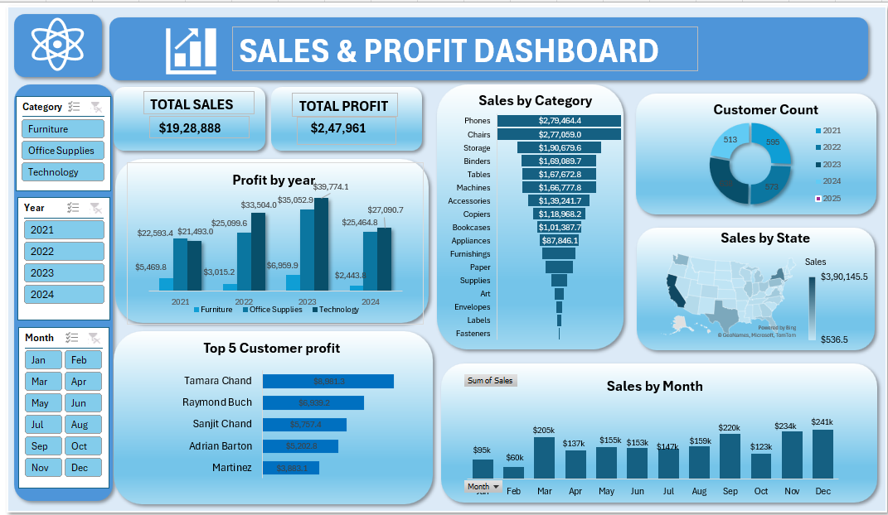

# 📊 Sales & Profit Dashboard (Excel Project)

## 📌 Project Overview

The Sales & Profit Dashboard is an interactive Microsoft Excel dashboard designed to provide comprehensive insights into business performance. It helps users analyze sales, profit, customer behavior, product categories and geographical sales distribution through dynamic visualizations.

The dashboard allows decision-makers to quickly identify trends, compare yearly performance and monitor key business metrics.

---

## 🎯 Objectives

- Analyze overall sales and profit performance.
- Track yearly sales trends.
- Compare sales across product categories.
- Monitor customer contribution and profitability.
- Analyze sales distribution by state.
- Identify monthly sales patterns.
- Enable interactive filtering for deeper analysis.

---

## 🛠 Tools & Features Used

- Microsoft Excel
- Pivot Tables
- Pivot Charts
- Slicers
- Data Cleaning
- Conditional Formatting
- Dashboard Design
- Data Visualization

---

## 📈 Dashboard KPIs

### 1. Total Sales
Displays the overall sales generated.

### 2. Total Profit
Shows the total profit earned.

### 3. Sales by Category
Analyzes sales across:
- Furniture
- Office Supplies
- Technology

### 4. Profit by Year
Year-wise profit comparison from:
- 2021
- 2022
- 2023
- 2024

### 5. Customer Count
Shows customer distribution across years.

### 6. Top 5 Customer Profit
Highlights the most profitable customers.

### 7. Sales by State
Geographical visualization of sales performance.

### 8. Sales by Month
Monthly sales trend analysis.

---

## 🎛 Interactive Filters

Users can dynamically filter the dashboard using:

- Category Filter
- Year Filter
- Month Filter

These slicers update all charts and KPIs instantly.

---

## 📊 Key Insights

- Monitor sales and profit growth.
- Identify best-performing product categories.
- Track customer profitability.
- Compare annual business performance.
- Understand regional sales distribution.
- Analyze seasonal sales trends.

---

## 📷 Dashboard Preview

---

## 📁 Project Structure

Sales-Profit-Dashboard/
│
├── Sales_Profit_Dashboard.xlsx
├── dashboard.png
└── README.md

---

